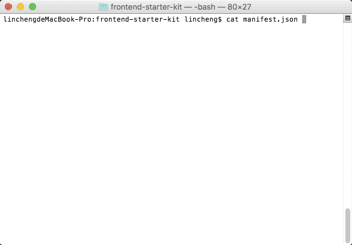

# assets-manager [![NPM version][npm-image]][npm-url] [![Build Status][travis-image]][travis-url] [![Dependency Status][daviddm-image]][daviddm-url] [![Coverage percentage][coveralls-image]][coveralls-url]
>  Assets manager provides a different approach to transfer the required files from your registry distributions to the target.

## Installation

```sh
$ npm install --save-dev assets-manager
```

## Work with gulp
You can integrate with gulp easily:
```js
var AssetsManager = require('assets-manager');
var manager = new AssetsManager('manifest.json');

gulp.task('assets', function(done){
  manager.copyPackages().then(function(){
    done();
  });
});
gulp.task('clean:assets', function(done){
  manager.cleanPackages().then(function(){
    done();
  });
});
```

### See in action
[]

## Usage

```js
import AssetsManager from 'assets-manager';

const assets = new AssetsManager('./manifest.json');

// copy all packages files to destination
assets.copyPackages();

// clean all packages files from destination
assets.cleanPackages();

// get packages info
assets.getPackagesInfo(['name', 'version', 'license']);

// look all packages
assets.forEachPackage(function(pkg){

});

// loop all js files in the packages
assets.forEachPackage('js', function(pkg, files){

});

// check if package defined in manifest
assets.hasPackage('jquery');

// get package handler
const pkg = assets.getPackage('bootstrap');

// get package info
pkg.getInfo();

// get package path
pkg.getPath();

// check if package is installed
pkg.isInstalled();

// get all files in package 
pkg.getFiles();

// get specfic type files in package
pkg.getFilesByType();

// get main files of package
pkg.getMainFiles();
```

## Registries
Assets manager can work with different package manager like **npm**, **bower**. It Also can use custom folders.

Just defined the registries in the manifest.json. The **npm** and **bower** are supported by default, you don't need define them again.

```js
"registries": {
  "vendor": "path-to-vendor",
  "libs": "path-to-lib"
}
```

## Example manifest.json
```js
{
  "cwd": "./",
  "registries": {
    "vendor": "libs"
  },
  "defaultRegistry": "npm",
  "verbose": true,
  "override": true,
  "ignoreError": true,
  "flattenPackages": true,
  "flattenTypes": false,
  "dest": "assets",
  "dests": {
    "images": "images",
    "fonts": "fonts",
    "js": "js",
    "coffee": "source/coffee",
    "es6": "source/es6",
    "css": "css",
    "stylus": "source/stylus",
    "less": "source/less",
    "sass": "source/sass",
    "scss": "source/scss"
  },
  "packages": {
    "bower:jquery": true,
    "npm:bootstrap": [{
      "js": "dist/js",
      "css": "dist/css",
      "less": "less",
      "fonts": "dist/fonts"
    }, {
      "replace": {
        "*.css": {
          "../fonts": "path-to-fonts"
        }
      }
    }],
    "vendor:modernizr": {
      "modernizr.js": "dist/modernizr.min.js",
    }
  }
}
```

## Global options
### cwd
The relative path to the root of the project.
Defaults to the manifest.json directory.

### flattenPackages
Whether to remove all package path parts from generated dest paths.
Defaults to true.

### flattenTypes
Whether to remove all type path parts from generated dest paths.
Defaults to false.

### verbose
Whether to output copy and clean files infos to console.
Defaults to true.

### override
Whether to override old exists destination files.
Defaults to true.

### ignoreError
Whether to ignore errors when do copy and clean task. If set to false will break the proceeding.
Defaults to true.

### defaultRegistry
Set default registry when package dont have a registry specify.
Defaults to npm.

### types
Set types that assets manage will classicfy files automatically.

Defaults:
```js
{
  js: '*.js',
  coffee: '*.coffee',
  es6: '*.es6.js',
  css: '*.css',
  stylus: '*.styl',
  scss: '*.scss',
  sass: '*.sass',
  less: '*.less',
  images: '*.{bmp,jpg,jpeg,png,gif,webp,tiff,wbmp,eps}',
  fonts: '*.{eot,otf,svg,ttc,ttf,woff,woff2}'
}
```

## Packages
### Package key
The package key in the manifest.json take the following form:
```
"registry:package"
"package"
```

The "package" shorter form will use the default registry.

### Package definition
You can write in the following ways define the package.

1.simple mode
```js
"PACKAGEKEY": true
```

It will use main files and use default options. 

2.use options only
```js
"PACKAGEKEY": [
  true,
  {
    "registry": "bower"
  }
]
```

It will use main files custom options.

3.use auto types only
It will look for all files in the package folder, and classify the files automatically. The default options will be used in this mode. 
```js
"PACKAGEKEY": "**/*"
```

You can use glob array also.
```js
"PACKAGEKEY": ["dist/**/*.js", "!dist/**/*.min.js"]
```

4.use auto types and options
```js
"PACKAGEKEY": ["**/*", {
  "registry": "bower"
}]
```

glob array supported too.
```js
"PACKAGEKEY": [["**/*", "!**/*.min.js"], {
  "registry": "bower"
}]
```

5.use types only
```js
"PACKAGEKEY": [{
  "js": "dist/js",
  "css": "dist/css"
}]
```

It will use custom types config and default options.

6.use types only alternatively
```js
"PACKAGEKEY": {
  "js": "dist/js",
  "css": "dist/css"
}
```

7.use types and options
```js
"PACKAGEKEY": [
  {
    "js": "dist/js",
    "css": "dist/css"
  },
  {
    "registry": "bower"
  }
]
```

It will use custom types config and custom options.

### Types config in the package definition

1.Simple path mapping
```js
{
  js: 'path-to-js',
  css: 'path-to-css'
}
```

2.Glob support
```js
{
  js: '*.js',
  css: 'css/*.css'
}
```

3.Array support
```js
{
  js: ['a.js', 'b.js'],
  css: ['css/*.css', '!css/*.min.css']
}
```

4.You can rename the files
```js
js: {
  'bootstrap.js': 'dist/js/bootstrap.js'
},
css: {
  'main.css':'dist/css/bootstrap.css',
  'theme.css':'dist/css/bootstrap-theme.css'
}
```

### Package options
#### defaults
```js
{
  flattenPackages: true,
  flattenTypes: false,
  verbose: true,
  override: true,
  registry: 'npm',
  replaces: {},
  renames: {}
}
```

#### flattenPackages, flattenTypes, verbose, override, registry
These options will override the global options.

#### replaces
It will replace the content when copy to target directory. Regex supported.
```js
"replaces": {
  "*.css": {
    "../fonts": "path-to-fonts",
    "/fa-(\w+)/g": "icon-$1"
  }
}
```

#### renames
It will rename the files when copy to target directory. Regex supported.
```js
"renames": {
  "jquery.min.js": "jquery.js",
  "*.min.css": ["/\.min\.css$/", ".css"]
}
```

#### Hooks
Assets manager provides 4 separate hooks that can be used to trigger other automated tools during assets copy or clean operate. 

```
"copy:pre": "<your command here>",
"copy:post": "<your command here>",
"clean:pre": "<your command here>",
"clean:post": "<your command here>",
```

## Todos
-   Hooks
-   Package name duplicate in different registries
-   File collections
-   Dependencies

## License

MIT © [amazingSurge](amazingSurge.com)

[npm-image]: https://badge.fury.io/js/assets-manager.svg
[npm-url]: https://npmjs.org/package/assets-manager
[travis-image]: https://travis-ci.org/amazingSurge/assets-manager.svg?branch=master
[travis-url]: https://travis-ci.org/amazingSurge/assets-manager
[daviddm-image]: https://david-dm.org/amazingSurge/assets-manager.svg?theme=shields.io
[daviddm-url]: https://david-dm.org/amazingSurge/assets-manager
[coveralls-image]: https://coveralls.io/repos/amazingSurge/assets-manager/badge.svg
[coveralls-url]: https://coveralls.io/r/amazingSurge/assets-manager
